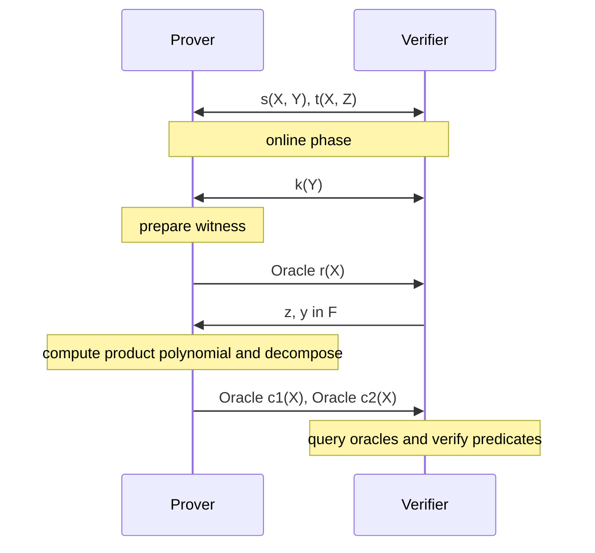

# NARK

## Revdot Products to Polynomial Predicates

Let's start with where we ended up in our arithmetization. The satisfiability
of our [Bootle16 constraint system](./arithmetization.md) culminates in a
single [consolidated constraint](./arithmetization.md#consolidated-constraints):

$$\revdot{\v{r}}{\v{r} \circ{\v{z^{4n}}} - \v{t} + \v{s}} = \dot{\v{k}}{\v{y^{4n}}}$$

where:
- the witness vector $\v{r}=(\v{c}\|\rv{b}\|\v{a}\|\v{0})\in\F^{4n}$
- the circuit wiring vector
$\v{s}=(\v{0^n}\| \sum_{j=0}^{4n-1}y^j\cdot\rv{u}_j \| \sum_j y^j\cdot\v{v}_j \| \sum_j y^j\cdot \rv{w}_j)$
- the `mul` constraint vector
$\v{t} = (\v{0^{3n}}\|\, (\rv{z}^{\bf n:2n} + \v{z}^{\bf 2n:3n})\cdot \rv{1})$
- the public input vector $\v{k}\in\F^{4n}$

Now we need to express this in terms of polynomials. The connection comes from
a fundamental property of polynomial multiplication: the coefficients of a
product polynomial are discrete convolutions. For polynomials $p, q\in\F[X]$
with coefficient vectors $\v{p}, \v{q}\in\F^{4n}$:

$$
p(X)\cdot q(X) =c(X)= \sum_{k=0}^{8n-2}c_k\cdot X^k
\quad\text{where }c_k=\sum_{i+j=k}\v{p}_i\cdot \v{q}_j
\text{ and } c_{4n-1}=\revdot{\v{p}}{\v{q}}
$$

This is exactly what we need! If we multiply $\hat{r}(X)\cdot r(zX)$, the
coefficient of its $X^{4n-1}$ term equals
$\revdot{\v{r}}{\v{r} \circ{\v{z^{4n}}}}$—the left side of our constraint.

But there's a problem. Our witness polynomials have degree less than $4n$, so
their product $c(X)$ has degree up to $8n-2$. We could commit to this
product directly, but that's expensive—committing to degree-$8n$ polynomials
costs roughly twice as much as degree-$4n$ polynomials. And we only care about
one coefficient (the $c_{4n-1}$ term), so paying double for the whole thing
seems wasteful.

### The Decomposition Trick

Instead of committing to the full product, we decompose it into two smaller pieces:

$$c(X) = c_{lo}(X) + X^{4n}\cdot c_{hi}(X)$$

where $\v{c}_{lo}=\v{c}_{[:4n]}\in\F^{4n}$ and $\v{c}_{hi}=\v{c}_{[4n:]}\in\F^{4n-1}$.
Both pieces now have degree less than $4n$, which is exactly what we want.

But we still need to extract that $c_{4n-1}$ coefficient—it's buried as the
last coefficient of $c_{lo}$. This is where the reversal trick comes in. Define:

$$c_1(X)=\hat{c}_{lo}(X), \quad c_2(X)=c_{hi}(X)$$

By reversing the coefficient vector of $c_{lo}$, we get
$\v{c}_1=\rv{c}_{lo}=(c_{4n-1},\ldots,c_0)$. Notice what happened: **the
coefficient we care about, $c_{4n-1}$, is now the constant term of $c_1(X)$**.
And we can check the constant term by evaluating at zero.
The prover commits to $c_1(X)$ and $c_2(X)$, and the verifier can:
1. Check the decomposition is correct by querying at a random point $x$
2. Extract the coefficient value by querying $c_1(0)$

That's the transformation: we've turned a coefficient check into evaluation
queries that our PCS can handle efficiently.

## Polynomial IOP

Now that we understand how to turn our coefficient check into polynomial
evaluations, let's build out the complete Polynomial IOP protocol.

We'll start by taking all those coefficient vectors from our arithmetization
and interpreting them as polynomials.

- **witness polynomial**:
  $r(X)=\sum_{i=0}^{n-1} (c_iX^i+b_iX^{2n-1-i}+a_iX^{2n+i})$
  - dilated witness polynomial: $r(XZ)$ corresponding to $\v{r}\circ\v{z^{4n}}$
  fixated at $z\in\F$
- **wiring/circuit polynomial**:
    $$
    s(X,Y)=\sum_{j=0}^{4n-1} Y^j\cdot\left(\sum_{i=0}^{n-1} (
        \v{u}_j^{(i)}\cdot X^{2n-1-i} +
        \v{v}_j^{(i)}\cdot X^{2n+i} +
        \v{w}_j^{(i)}\cdot X^{4n-1-i}
    )\right)
    $$
- **gate polynomial**:
  $t(X, Z)=\sum_{i=0}^{n-1} (Z^{2n-1-i}+Z^{2n+i})\cdot X^{4n-1-i}$
- **public input polynomial**: $k(Y) = \sum_{j=0}^{4n-1} \v{k}_j\cdot Y^j$

We'll use the notation $\mathcal{O}^p$ for a polynomial oracle provided by the
prover. Think of an oracle as a black box that the verifier can query—they can
ask "what does $p$ evaluate to at point $z$?" and get back both the answer and
a proof it's correct. When we compile this with a PCS later, these oracles
become polynomial commitments with evaluation proofs.

Here's how the protocol flows:

1. **Setup**: The circuit polynomials $s(X, Y)$ and $t(X, Z)$ are shared
   between prover and verifier. These encode the structure of the circuit and
   don't change per proof.

2. **Public input**: The public input polynomial $k(Y)$ is shared.

3. **Witness commitment**: The prover commits to the witness polynomial $r(X)$.

4. **Random challenges**: The verifier sends random challenges $z, y\in\F$.
   These are used to partially evaluate $s(X,y), t(X,z)$ such that the
   consolidated revdot product corresponds to a predicate about _univariate
   polynomials only_.

5. **Product and decomposition**: The prover computes the product polynomial
   $\hat{r}(X) \cdot r(zX)$, decomposes it into $c_1(X)$ and $c_2(X)$ using the
   trick we described earlier, and commits to both.

6. **Verification**: The verifier runs the checks we'll describe below.

### The Verification Checks

The verifier samples a random point $x\sample\F$ and queries the oracles at
specific points. Let's walk through what gets checked and why:

The verifier queries:
- $\mathcal{O}^r$ at $0, x, xz$
- $\mathcal{O}^{c_1}$ at $0, x^{-1}$
- $\mathcal{O}^{c_2}$ at $x$

Then computes locally:
- $s(x,y), t(x,z), k(y), k(0)$

And verifies three equations:
$$
\begin{cases}
  r(x) \cdot (r(xz) + s(x,y)- t(x,z))\iseq x^{4n-1}c_1(x^{-1}) + x^{4n} c_2(x)
      &\text{correct decomposition}\\
  c_1(0)\iseq k(y) &\text{consolidated CS check}\\
  r(0)\iseq k(0)\iseq 1 &\text{public "one"}
\end{cases}
$$

The first equation checks that $c_1(X)$ and $c_2(X)$ are actually the
decomposition of the product polynomial. The second equation is the main
constraint check—remember, $c_1(0)$ extracts the coefficient we care about. The
third equation enforces that the first element of the witness is the public
constant `ONE`, which is a convention in our constraint system.

### Performance Characteristics

This PIOP works, but it's not as efficient as we'd like. Here are the main
bottlenecks:

**Prover overhead**: Computing the product polynomial $\hat{r}(X) \cdot r(zX)$
and then decomposing it into $c_1(X)$ and $c_2(X)$ is expensive. We need at
least 3 FFTs over a domain of size $8n-2$[^prod-cost]. This is the most
expensive step for the prover.

**Verifier computation**: The verifier needs to evaluate $s(x,y)$ locally,
which is a linear-cost operation $O(|\Cir|)=O(n)$.

**Multiple PCS queries**: The verifier makes multiple polynomial oracle queries
(to $r$, $c_1$, and $c_2$), and each requires a PCS evaluation proof. When
using [Bulletproofs-based PCS](../prelim/bulletproofs.md), verification is
linear time per query, so these costs add up.

These inefficiencies are addressed in the next sections through various
optimizations, but the core protocol structure remains the same.

[^prod-cost]: FFT two multiplicands, each of polynomial of degree $4n-1$, over
an evaluation domain of size $\geq 8n-1$, then IFFT back to get the coefficient
of the product polynomial before decomposing.

## NARK

We now compile our Polynomial IOP into a concrete proof system. This requires
two components: a Polynomial Commitment Scheme (PCS) to instantiate the
oracles, and the Fiat-Shamir transformation to make everything non-interactive.
The result is a Non-interactive Argument of Knowledge (NARK).

We present the interactive version for clarity. The non-interactive version
follows directly by replacing verifier challenges with hash-derived values.

Denote hiding commitments as $\bar{C}\in\G$ with blinding factor $\gamma\in\F$,
and non-hiding commitments as $C\in\G$ with zero blinding factor.
Ragu NARK works as follows:

1. Prover commits public input and witness polynomials:
  $K\leftarrow\com(k(Y)), \bar{R}\leftarrow\com(r(X);\gamma_r)$,
  sends $K,\bar{R}\in\G$ to the Verifier.
2. Verifier sends back challenges $z, y\sample\F$
3. Prover
   - computes and commits the partially evaluated wiring polynomial:
     $S\leftarrow\com(s(X,y))$
   - defines local witness for the "left multiplicand":
     $\v{a}:=\v{r},\bar{A}:=\bar{R}$  (i.e. $a(X):=r(X)$)
   - derives the "right multiplicand": $\v{b}=\v{r}\circ\v{z^{4n}}+\v{s}-\v{t}$
      (i.e. $b(X):=r(zX) + s(X,y) - t(X,z)$) and commits to it:
     $\bar{B}\leftarrow\com(b(X);\gamma_b)$
   - evaluates $c=k(y)\in\F$
   - sends $(S, \bar{A}, \bar{B}, c)\in\G^3\times\F$ to the verifier[^resend-A]
4. Prover and Verifier engage in **wiring consistency protocol**, ensuring $S$ is
the correct commitment to partially evaluated univariate polynomial $s(X,y)$
   - Prover sends the full $s(X,y)$ over
   - Verifier checks by re-evaluating $s(X,y)$ and re-commit $S$
5. Prover and Verifier engage in **revdot product protocol**, ensuring the relation
  $\revdot{\v{a}}{\v{b}}=c$
   - Prover sends the full $\v{a},\v{b}\in\F^{4n}$ and their blinding factors
     $\gamma_a,\gamma_b\in\F$ over
   - Verifier checks by recomputing the revdot product and re-commit $\bar{A},\bar{B}$
6. Verifier sends back challenge $x\sample\F$
7. Prover sends evaluations $evals=(a(x), a(xz), s(x,y), b(x))\in\F^4$ over
8. Verifier locally computes $t(x,z)$ and checks $b(x)\iseq a(xz) + s(x,y) -t(x,z)$
9. Prover and Verifier engage in **batched evaluation protocol**, ensuring that
  the following (commitment, point, eval) evaluation claims are correct:
  $(\bar{A}, 0, 1),(\bar{A}, x, a(x)), (\bar{A}, xz, a(xz)),
  (\bar{B}, x, b(x)),(S, x, s(x,y)), (K, 0, 1), (K, y, c)$
   - they first run a [PCS aggregation](./accumulation/pcs.md#pcs-aggregation)
     subroutine to collectively reduce all claims to a single claim $(P, u, v)$
   - prover then sends the aggregated polynomial $\v{p}\in\F^{4n}$ and the
     aggregated blinding factors to the verifier who can recompute $P\in\G$,
     and checks $p(u)\iseq v$

[^resend-A]: In this standalone NARK,
$a(X)=r(X), \bar{A}=\bar{R}$, since $\bar{R}$ is already sent in Step 1,
technically we don't need to resend the $\bar{A}$ here. We present as such to be
structurally similar to the NARK for $\Rel_{merge}$ relation later.

### Proof Structure

The NARK proof splits into instance and witness parts:
$\pi_{\mathsf{NARK}}:=(\pi.\inst,\pi.\wit)$.
The instance part is succinct:

$$\pi.\inst=(K,\bar{R},\bar{A},\bar{B}, c, evals, P, u, v)$$

The witness part has linear size (hence NARK, not SNARK):

$$\pi.\wit=(\v{s},\v{a},\v{b},\gamma_a,\gamma_b,F, evals', \v{p})$$

where $F\in\G$ and $evals'\in\F^4$ are prover messages from the PCS
aggregation subroutine.

The verifier runs in sublinear time _except for the three subprotocols_: wiring
consistency, revdot product, and PCS evaluations. Our goal is to use
[split-accumulation](./accumulation/index.md) to accumulate the claims and defer
the actual expensive checks, achieving an overall sublinear partial verifier
suitable for recursion.

### Design Rationale

This protocol makes several choices that seem strange for a standalone NARK but
exist for a reason: they prepare us for recursion.

**Why separate $\bar{A}$ from $\bar{R}$?** 
During [recursion](../recursion/index.md), the witness polynomial commitment
$\bar{R}$ binds the current step's witness, while $\bar{A}$ is an aggregated
commitment for a batch of accumulated revdot product statements. By separating
them now, our NARK is structurally similar to the eventual recursion logic.

**Why run PCS evaluation protocol at all?**  In step 5, the
verifier receives the full $\v{a}$, so why run an evaluation protocol for
$a(x)$ and $a(xz)$? During actual recursion, the prover never sends polynomial
coefficients directly. Instead, commitments in evaluation claims are accumulated
forward. Our NARK is consistent with future recursion in its modular presentation.

**Why no zero-knowledge?**  The prover sends unmasked witness vectors
$\v{a},\v{b}$, making this NARK not zero-knowledge. This is intentional. Ragu
avoids leakage through **rerandomization** rather than requiring zero-knowledge
NARK. Each PCD step can merge with a random trivial proof to rerandomize the
original proof. This differs from [[BCLMS21]](https://eprint.iacr.org/2020/1618),
which builds zk-PCD from a split-accumulation scheme for zk-NARK.

**Why verify the revdot product directly?**  The prover cannot simply check
revdot relation by evaluating $a(x)\cdot b(x)$ at a random point $x$ because the
product polynomial has degree $8n-2$, exceeding our $4n-1$ degree bound. This
breaks the knowledge extractor for the PCS, which in turn breaks knowledge
soundness of the NARK. We could avoid the revdot product subprotocol by using
polynomial decomposition as in the PIOP section. That approach maintains low
polynomial degrees but requires expensive FFTs. Instead, we verify the revdot
product directly, accepting slightly larger proof size in exchange for better
prover performance. At PCD tree locations where succinctness is critical, we
can switch to the decomposition variant.

These design choices will make sense once we elaborate the
[recursion logic](../recursion/index.md). For now, convincing yourself that
our NARK is complete and sound is sufficient.
